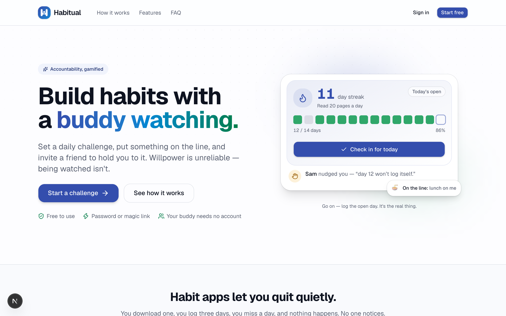
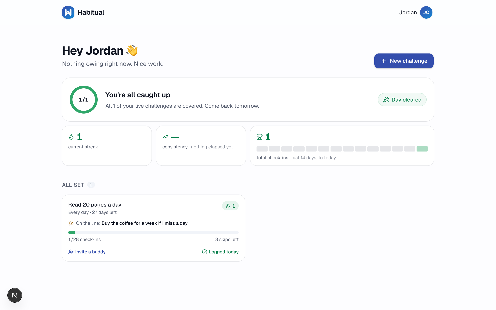
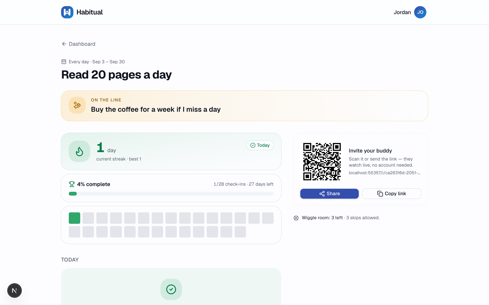
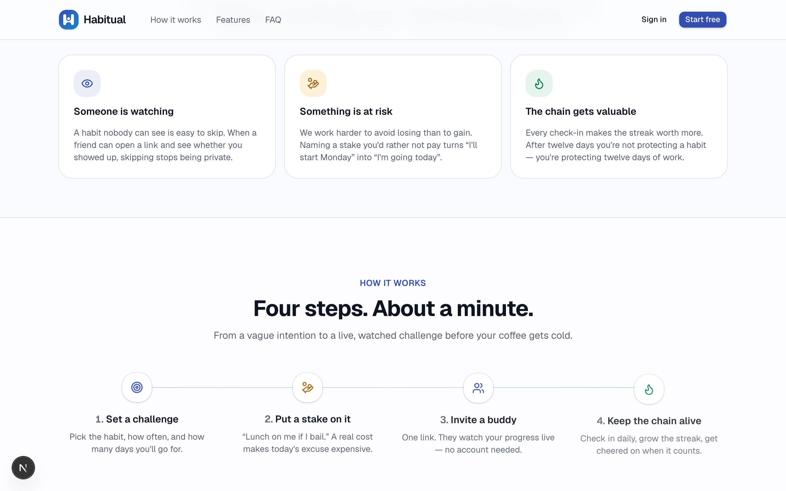
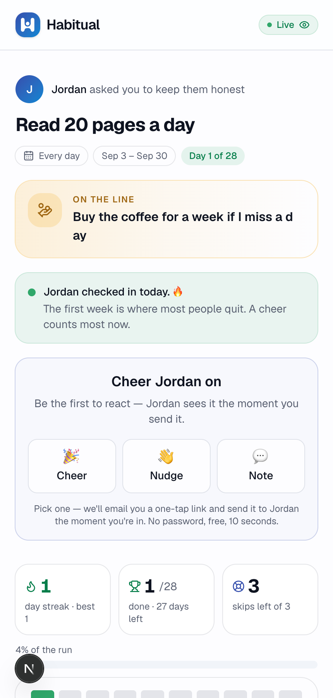

# Habitual

**A mobile-first habit tracker where you put something on the line and invite a friend to watch.** Set a challenge, name a stake, send a link — no account needed on their end — and they can cheer, nudge, or call you out in real time.

**Live demo:** [habitual-app-kappa.vercel.app](https://habitual-app-kappa.vercel.app/)



## Why

Solo habit trackers are easy to quietly abandon — you miss a day, nothing happens, no one notices. Habitual's bet is that **accountability beats willpower**: a real stake plus a buddy who can actually see whether you showed up changes the incentive. The buddy doesn't need an account — one link opens a live view of the challenge with one-tap reactions, so there's zero friction between "I want someone to check on me" and them actually doing it.

## What it looks like

| Dashboard | Challenge detail |
|---|---|
|  |  |

| Landing page — features | Buddy view (no account, mobile) |
|---|---|
|  |  |

## Features

- **Real cadences, not just daily** — daily, weekdays, weekly (any day or a set day), fortnightly, monthly.
- **Three ways to measure progress** — a simple tick, a per-check-in target ("20 pages"), or a cumulative running total.
- **Built-in slack** — a skip budget (a fixed count or a %) and an optional back-to-back-miss limit, so one bad day doesn't sink the whole challenge.
- **A real stake** — you name what you lose if you bail; your buddy sees it, which is the point.
- **No-account buddy view** — a shareable link (and QR code) opens a live, read-only view of the challenge with one-tap Cheer / Nudge / Note reactions.
- **Buddy → account growth loop** — a buddy who reacts enough gets invited to create their own account and challenge.
- **Streaks, consistency %, and a 14-day activity strip** in place of vanity totals, plus a "what needs you now" panel with a single next-action CTA.
- **Magic-link or password auth**, dark mode, and a mobile-first responsive layout throughout.

## Tech stack

| Layer | Choice | Why |
|---|---|---|
| Framework | [Next.js 15](https://nextjs.org/) (App Router), React 19 | Server Actions *are* the backend — no separate API layer for anything an action can do. The only route handler in the app is the auth callback. |
| Styling | [Tailwind CSS v4](https://tailwindcss.com/), [shadcn/ui](https://ui.shadcn.com/) on the `radix-ui` umbrella package | Utility-first styling with accessible, unstyled primitives underneath — three brand colors (indigo/green/amber), each with one job. |
| Backend & data | [Supabase](https://supabase.com/) — Postgres, Auth, Row Level Security | Postgres with RLS as the actual authorization layer, not just an app-level check. Cross-table visibility (e.g. showing a buddy's name) goes through `SECURITY DEFINER` RPCs rather than opening up direct table reads. |
| Language | TypeScript | End to end, including generated types from the Postgres schema. |
| Hosting | [Vercel](https://vercel.com/) | `main` auto-deploys. |
| Icons / extras | `lucide-react`, `canvas-confetti`, `qrcode.react` | Confetti on check-in, a QR code for the buddy invite link. |

## Architecture notes

A few decisions that shaped the codebase, for anyone reading the source:

- **Status is derived, never stored.** `evaluateChallenge()` (in [`src/lib/challenges.ts`](./src/lib/challenges.ts)) recomputes streak, progress, and pass/fail state from raw check-ins on every read, working in *periods* (one slot to fill per cadence) rather than calendar days. Nothing about "is this challenge on track" is cached or written back.
- **RLS is the authorization boundary.** `public.users` is self-read-only — there is no query path that lets one user read another user's profile directly. Anything that legitimately needs cross-user visibility (a buddy's name, reactions on a challenge, resolving an invite link) goes through a narrow `SECURITY DEFINER` RPC instead of a broader table grant.
- **Server Actions instead of a REST/GraphQL layer.** Mutations live next to the routes that use them (`actions.ts` files under each route segment); the only conventional route handler in the app is the Supabase PKCE auth callback.
- **Dates are UTC calendar days**, always produced and compared through the same `todayISO()` / `addDays()` helpers, so what gets written and what gets read never drift across timezones.

## Getting started

```bash
npm install
cp .env.example .env.local   # fill in your own Supabase project URL + anon key
npm run dev
```

Open [http://localhost:3000](http://localhost:3000).

> **A fresh clone does not include the database.** This repo doesn't ship a
> `supabase/migrations/` folder — schema changes were applied straight to the
> hosted project via the Supabase MCP server. To run this yourself, point it at
> your own Supabase project and recreate the schema (5 tables + RLS policies —
> see the "Architecture notes" above and [`AGENTS.md`](./AGENTS.md) for the
> shape of it).

### Environment

| Variable | Purpose |
|---|---|
| `NEXT_PUBLIC_SUPABASE_URL` | Supabase project URL |
| `NEXT_PUBLIC_SUPABASE_ANON_KEY` | Supabase publishable (anon) key — safe to expose client-side; access is governed by RLS |
| `NEXT_PUBLIC_SITE_URL` | Canonical base URL for OG tags, `robots.txt`/`sitemap.xml`, and server-rendered invite links. Doesn't affect magic-link sign-in, which resolves the origin from the request. Build-time inlined, so changing it needs a redeploy. |

Only the Supabase **anon** key is ever used, client- or server-side — there's no service-role key anywhere in this codebase, and every table it touches is behind Row Level Security.

## What's built

The core spine (waves 0–5 of the original plan) is complete and deployed; everything since has been user-requested work outside the plan. See [PLAN.md](./PLAN.md) for the original product plan and data model, and [AGENTS.md](./AGENTS.md) for the conventions and gotchas worth knowing before changing anything.

**Waves 0–5 — shipped**

- **0 · Foundations** — Next.js + Tailwind + shadcn, mobile shell, brand theme, Supabase wired, deployed.
- **1 · Data layer & auth** — 5 tables with RLS (cross-table visibility via `SECURITY DEFINER` helpers), magic-link sign-in, protected `/dashboard`.
- **2 · Owner loop** — create a challenge, log check-ins, streaks and progress.
- **3 · Sharing & buddy view** — invite token per challenge, public no-auth `/i/[token]` view, QR + Web Share + copy link.
- **4 · Growth loop** — invite claim on sign-in, buddy reactions (cheer / nudge / note), "I'm a buddy on" list.
- **5 · Gamification polish** — confetti on check-in, streak hero, landing page.

**Beyond the plan**

- **UI/UX overhaul** — responsive shell (the whole app used to be a 448px strip on desktop), dark mode, landing redesign, error/loading/not-found routes, OG images, robots + sitemap, accessibility fixes.
- **Password auth** — alongside magic link, plus a buddy → account conversion ladder, `/signup`, `/forgot-password`, `/account/password`.
- **Real cadences & rules** — daily / weekdays / weekly / fortnightly / monthly, a skip budget and a back-to-back miss limit, and three goal modes (tick, per-check-in target, cumulative total). Scoring moved from calendar days to *periods*; status is derived on read, never stored.
- **Profile & account page** — first/last name and nickname, theme picker, email change; the header reduced to wordmark + avatar.
- **One check-in a day** — enforced by a unique constraint rather than an upsert, with a receipt card in place of an edit form.
- **Dashboard redesign** — a "what needs you now" panel with a completion ring and a single next-action CTA, consistency % and a 14-day activity strip in place of vanity totals, challenges sorted into needs-you / all-set / finished, and cards that show the stake, buddy status, cheer count, and a one-tap check-in.

**Not built** — PLAN.md Wave 6 (stake as a first-class object with paid/forgiven, buddy-granted trophy, public challenge listing) and Wave 7 (nudge emails, groups, leaderboards, points).

## License

[MIT](./LICENSE)
