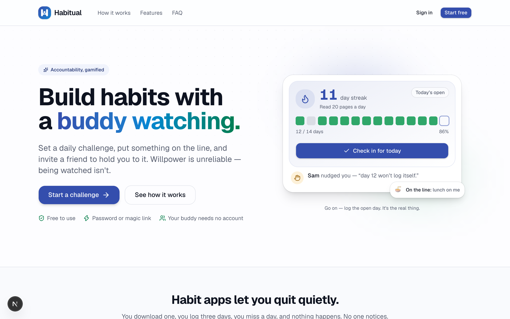
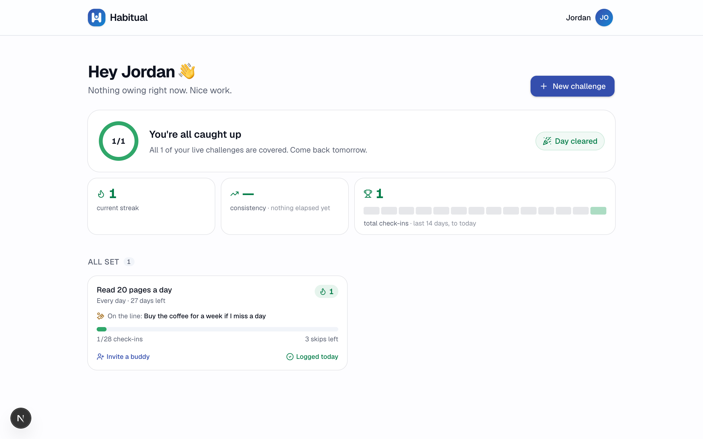
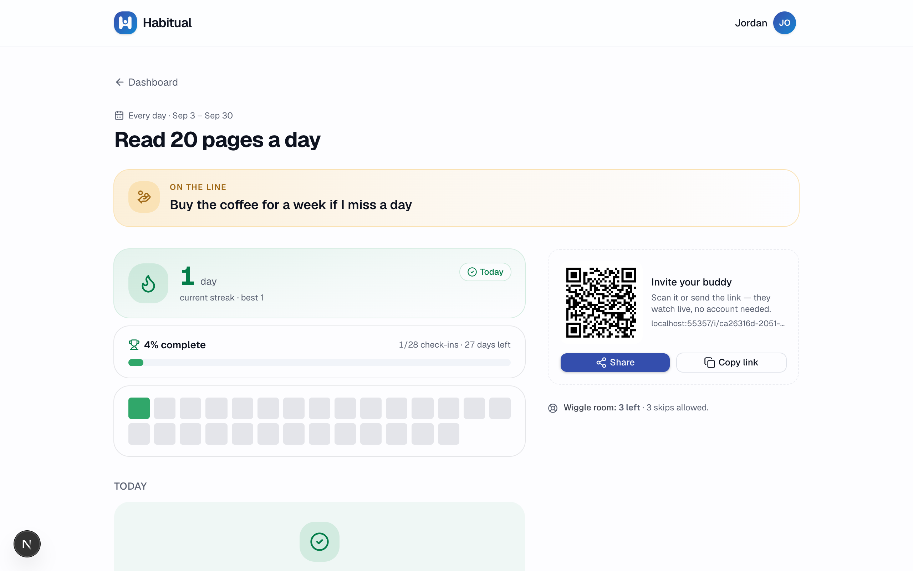
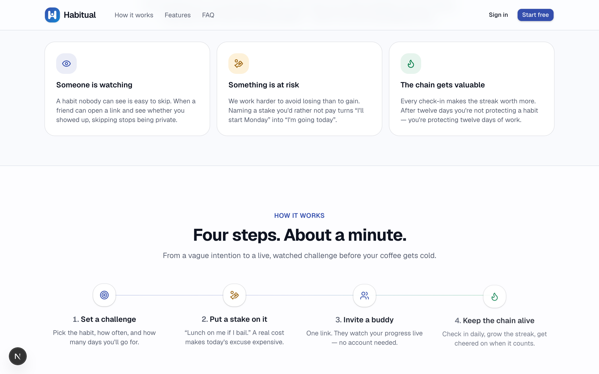
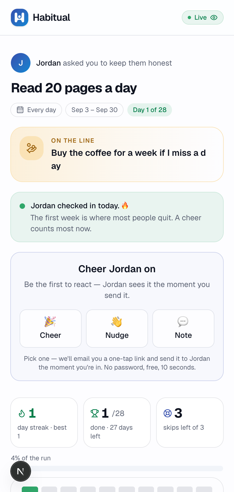
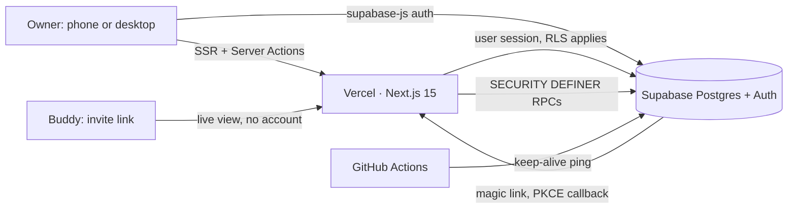

<p align="center">
  
</p>

<p align="center">
  <a href="https://habitual-app-kappa.vercel.app"><b>Live app →</b></a>
  ·
  <a href="#features">Features</a>
  ·
  <a href="#how-its-built">How it's built</a>
  ·
  <a href="#run-it-yourself">Run it yourself</a>
</p>

<p align="center">
  
  
  
  
  
  
  <a href="https://github.com/andriuskleinas/habitual/actions/workflows/ci.yml"></a>
  
</p>

# Habitual 🔥

**A mobile-first habit tracker where you put something on the line and invite a friend to watch.**
Set a challenge, name a stake, send a link. Your buddy doesn't need an account to follow along, and
can cheer, nudge or call you out as you go.

## Why

Solo habit trackers are easy to quietly abandon: you miss a day, nothing happens, no one notices.
Habitual's bet is that **accountability beats willpower**. A real stake plus a buddy who can see
whether you showed up changes the incentive. One link opens a live view of the challenge, so there's
no friction between "I want someone to check on me" and them actually doing it.

## The app

| Dashboard | Challenge detail |
|---|---|
|  |  |

| Landing page: features | Buddy view (no account, mobile) |
|---|---|
|  |  |

## Features

| | Feature | What it does |
|---|---|---|
| 🗓️ | **Real cadences** | Daily, weekdays, once a week (any day or a set day), every two weeks, monthly. |
| 🎯 | **Three ways to measure** | A simple tick, a per-check-in target ("20 pages"), or a cumulative total with a pace line showing how far ahead or behind you are. |
| 🛟 | **Built-in slack** | A skip budget (a fixed count or a %) and an optional back-to-back-miss limit, so one bad day doesn't sink the whole challenge. |
| 💸 | **A real stake** | You name what you lose if you bail. Your buddy sees it, which is the point. |
| 👀 | **No-account buddy view** | A shareable link and QR code open a live, read-only view of the challenge with one-tap Cheer / Nudge / Note reactions. |
| 🌱 | **Buddy → owner loop** | A buddy who reacts enough is invited to start a challenge of their own. |
| 📈 | **Honest stats** | Streaks, consistency %, and a 14-day activity strip instead of vanity totals, plus a "what needs you now" panel with one next action. |
| 🌗 | **Built for phones** | Mobile-first layout that grows into a desktop shell, dark mode, confetti on check-in. |

## How it's built


```mermaid
flowchart LR
  O[Owner: phone or desktop] -->|SSR + Server Actions| V[Vercel · Next.js 15]
  B[Buddy: invite link] -->|live view, no account| V
  O -->|supabase-js auth| S[(Supabase Postgres + Auth)]
  V -->|user session, RLS applies| S
  V -->|SECURITY DEFINER RPCs| S
  S -->|magic link, PKCE callback| V
  GH[GitHub Actions] -->|keep-alive ping| S
```

| Layer | Choices |
|---|---|
| **Frontend** | Next.js 15 App Router (Server Components, streaming `loading.tsx` routes), React 19, Tailwind CSS 4, shadcn/ui on Radix primitives, `lucide-react`, `qrcode.react`, `canvas-confetti` |
| **Backend** | Server Actions are the backend: mutations live in `actions.ts` next to the routes that use them. The only route handler is the auth callback. |
| **Database** | Supabase Postgres, 5 tables with row-level security on every one. Cross-user reads (invite lookup, claiming an invite, reactions with names) go through narrow `SECURITY DEFINER` RPCs. A unique constraint enforces one check-in per day. |
| **Scoring** | One pure module, `src/lib/challenges.ts`, derives streaks, progress, skips and win/fail state from raw check-ins on every read. Nothing about status is stored. |
| **Auth** | Supabase Auth: email + password or magic link (PKCE), password reset, email change, a magic-link buddy can add a password to become a full account, 30-minute idle sign-out |
| **Quality** | 17 unit tests on the scoring engine (Node's built-in test runner, no extra deps); GitHub Actions runs typecheck, lint, tests and a production build on every push |
| **Hosting** | Vercel, deployed from `main`; a scheduled GitHub Action keeps the free-tier Supabase project from pausing |

### Engineering highlights

- **Status is derived, never stored.** `evaluateChallenge()` recomputes streak, progress and
  pass/fail from raw check-ins on every read. It works in *periods* (one slot to fill per cadence)
  instead of calendar days, so "4 of 12 weeks" means the same thing as "12 of 30 days". A period only
  counts as missed once it has fully elapsed, so today's empty slot never breaks your streak.
- **RLS is the authorization layer.** `public.users` is self-read only; no query lets one user read
  another's profile. Anything that legitimately needs cross-user visibility goes through a narrow
  `SECURITY DEFINER` RPC instead of a broader table grant.
- **Only the anon key, anywhere.** There's no service-role key in this codebase. Every query runs as
  the signed-in user (or anonymous) and is checked by Postgres.
- **One clock.** Dates are UTC calendar days, always produced and compared through the same
  `todayISO()` / `addDays()` helpers, so what gets written and what gets read never drift.
- **Three colours, three jobs.** Indigo for structure and calls to action, green for progress, amber
  for stakes and nudges. Green and amber each have a darker "ink" variant for text so body copy
  clears WCAG 4.5:1.

## Run it yourself

You need Node.js 22.18+ and a [Supabase](https://supabase.com) project.

```bash
git clone https://github.com/andriuskleinas/habitual.git
cd habitual
npm install
cp .env.example .env.local   # your own Supabase URL + anon key; never commit .env.local
npm run dev
```

Open [http://localhost:3000](http://localhost:3000).

> **A fresh clone does not include the database schema.** Schema changes were applied straight to
> the hosted project through the Supabase MCP server, so there's no `supabase/migrations/` folder
> yet. To run this yourself, recreate the 5 tables and their RLS policies in your own project. See
> the data model in [PLAN.md](./PLAN.md) and the conventions in [AGENTS.md](./AGENTS.md).

### Checks

```bash
npm test             # scoring engine: cadences, streaks, skip budget, totals, pace
npm run typecheck
npm run lint
```

### Environment

| Variable | Purpose |
|---|---|
| `NEXT_PUBLIC_SUPABASE_URL` | Supabase project URL |
| `NEXT_PUBLIC_SUPABASE_ANON_KEY` | Supabase publishable (anon) key. Safe to expose; access is governed by RLS. |
| `NEXT_PUBLIC_SITE_URL` | Canonical base URL for OG tags, `robots.txt` / `sitemap.xml`, and server-rendered invite links. Sign-in doesn't depend on it. Inlined at build time, so changing it needs a redeploy. |

## What's built

Built in waves from [PLAN.md](./PLAN.md). Waves 0–5 (foundations, data and auth, the owner loop,
sharing and the buddy view, the growth loop, gamification) are shipped and live. Since then:

- **Real cadences and rules**: five cadences, a skip budget, a back-to-back miss limit and three goal
  modes. Scoring moved from calendar days to periods.
- **Password auth** alongside magic links, plus a buddy → account path, `/signup` and
  `/forgot-password`.
- **Dashboard redesign**: a "what needs you now" panel, consistency % and a 14-day strip, and
  challenge cards with the stake, buddy status, cheer count and a one-tap check-in.
- **Polish**: responsive desktop shell, dark mode, OG images, robots + sitemap, error and loading
  routes, accessibility fixes.

**Next up**: the stake as a first-class object (paid / forgiven), a buddy-granted trophy, nudge
emails, groups and leaderboards (PLAN.md waves 6–7).

## License

[MIT](./LICENSE)
